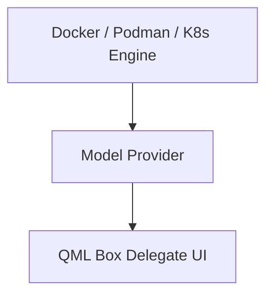

# DmsDockerManager Architecture Proposal

## Overview
This proposal introduces a decoupled projection layer for DankMaterialShell container management.

## Defensive Coding Standards
- Property guards on uninitialized container state.
- Debounced signal propagation.
