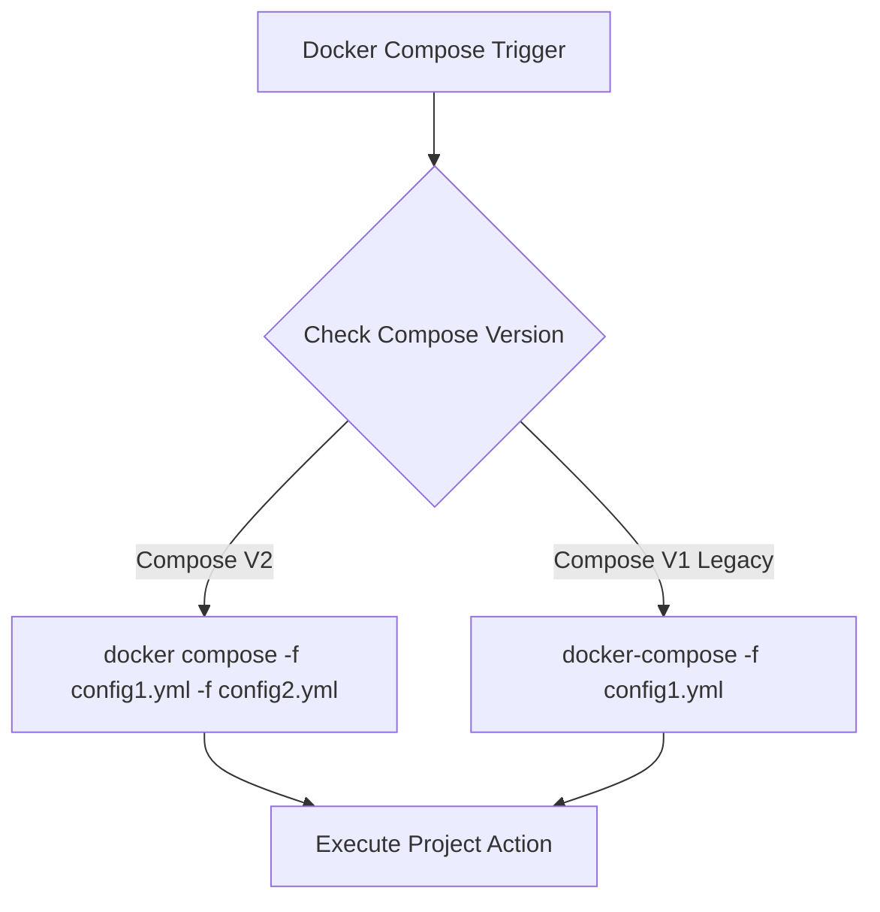

# Docker Compose Multi-Config & Fallback Specification

## Architecture & Flow

## Fix Summary
- Support multi-file `-f` compose declarations in project status checks.
- Fall back gracefully when legacy `docker-compose` binary is present instead of plugin `docker compose`.
