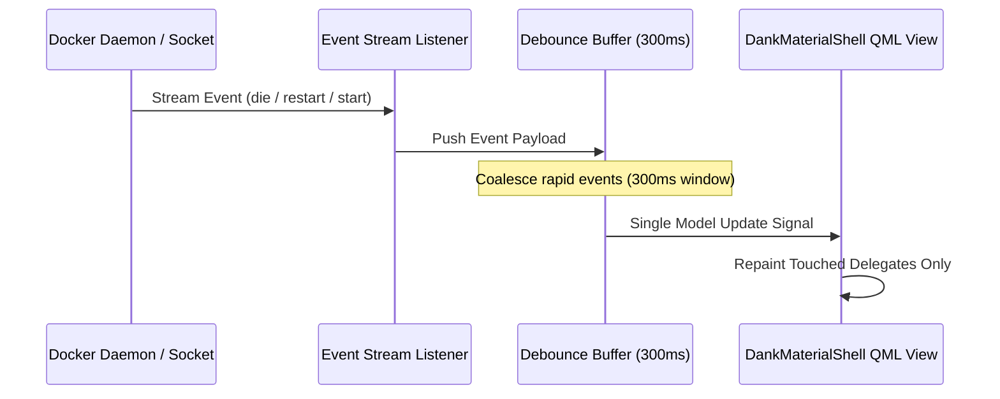

# Event Stream Resilience Guidelines

## Architecture & Flow

```mermaid
sequenceDiagram
    participant Daemon as Docker Daemon / Socket
    participant Listener as Event Stream Listener
    participant Debouncer as Debounce Buffer (300ms)
    participant QML as DankMaterialShell QML View

    Daemon->>Listener: Stream Event (die / restart / start)
    Listener->>Debouncer: Push Event Payload
    Note over Debouncer: Coalesce rapid events (300ms window)
    Debouncer->>QML: Single Model Update Signal
    QML->>QML: Repaint Touched Delegates Only
```

## Resilience Guarantees
- Exponential backoff on daemon disconnect.
- Debounced QML invalidation.
